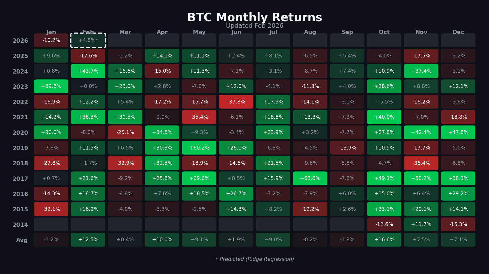

# BTC Monthly Returns Dashboard

A simple visualization of Bitcoin's monthly percentage gains and losses since 2014.

## Latest Dashboard



## Features

- **Historical data** from Yahoo Finance (2014-present)
- **Monthly averages** row showing typical performance per month
- **ML prediction** for current month using Ridge Regression (marked with `*` and dashed border)
- **Auto-updates** on the 1st of each month via GitHub Actions

## Structure

```
btc-dashboard/
├── src/build_price_dashboard/
│   ├── main.py       # Fetches data, generates heatmap
│   └── predict.py    # Ridge regression prediction
├── outputs/{month}-{year}/
│   └── btc_monthly_returns.png
├── .github/workflows/
│   └── update-dashboard.yml
└── README.md
```

## Run Locally

```bash
pip install -r requirements.txt
python src/build_price_dashboard/main.py
```

## Prediction Model

Features used:
- Lagged returns (1, 2, 3 months)
- Moving averages (3, 6 months)
- Rolling volatility
- Momentum, streak, YTD return
- Seasonality (month encoding)

Not financial advice. Crypto is unpredictable.

---

*Auto-updated monthly via GitHub Actions*
